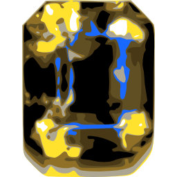

# Mellite

## statement

Mellite is a graphical front end for [SoundProcesses](http://github.com/Sciss/SoundProcesses). It is (C)opyright 2012&ndash;2013 by Hanns Holger Rutz. All rights reserved. Mellite is released under the [GNU General Public License](http://github.com/Sciss/Mellite/blob/master/licenses/Mellite-License.txt) and comes with absolutely no warranties. To contact the author, send an email to `contact at sciss.de`.

## building

Mellite builds with sbt 0.13 and Scala 2.10. The dependencies should be downloaded automatically from maven central repository, except for snapshots during development.

Dependencies not found are all available from their respective [Github repositories](https://github.com/Sciss?tab=repositories), so in case you want to build a snapshot version, you may need to check out these projects and publish them yourself using `sbt publish-local`.

## documentation

Note that this project is in __highly experimental__ state. While I have been composing already pieces with it, I recommend anyone to approach this with extreme care. I cannot guarantee that the application is bug free, in particular you may end up with a corrupt session database (although unlikely), and also I might introduce changes that render it impossible for new versions to open sessions created with previous versions. You have been warned!

Otherwise, here are some hints:

- Mellite uses a persistent database to store your session. It means it keeps track of the history of your composition process. The data structures have been developed to provide good performance even under extreme growth of the data base. You will still notice an occasional slugginess or GC pauses during your work. If you want a more traditional approach, have a look at the predecessor project [Kontur](http://github.com/Sciss/Kontur). In particular, there is no undo-redo mechanism in place right now, although if you really mess up, you can still go to previous versions of your piece by creating a new _cursor_.
- Mellite stores the session in an opaque folder ending in `.mllt`. On OS X this folder appears as a closed file. You should consider it as such. This "file" can easily grow to hundreds of megabytes during the course of a composition. This is "normal" behaviour, as the database keeps track of each and every action you perform.
- To create a new project, choose File -> New and select the database location. You will be presented with the document's cursor window which contains exactly one "master" cursor. Cursors can be understood as branches in a git repository. They represent historical trajectories. In most cases you will just use the one master cursor. If you select it and press "View", you are presented with the document elements view.
- The document elements are an arbitrarily ordered collection of objects which constitute your composition: Audio files (also called Audio Graphemes), timelines (also callec ProcGroups), numbers and strings, code fragments, folders which help you to organise your elements.
- Try creating a new timeline/ProcGroup, by pressing the "+" button in the document elements view and selecting "ProcGroup". Once the process group has been created, select it and press "View" to open it. This presents you with a rather traditional timeline view. Cursor and mouse navigation is somewhat similar to Eisenkraut and Kontur.
- To create an audio region on the timeline, there are two possibilities. The most straight forward one is to open the sound file in Eisenkraut, make a selection and perform a Drag-and-Drop using the "Region" button in Eisenkraut. After you drop the region, Mellite will try to figure out the "location" of the sound file. Every sound file must be associated with a location which is any parent folder of the sound file. The reason for this is that you may migrate your session to other computer or harddrive, so we want to be able to adjust all sound file paths based on an exchange of their location. If there aren't any location objects in your session, Mellite will prompt you to choose a parent folder of the new sound file, for which a location object will then be created. You can also manually create artifact locations in the document elements view.
- The second possibility is to add the sound file to the document elements view, then open the file (select it and press "View"). This opens a sonogramme overview of that sound. Due to some changes, playback is currently not enabled in that view, but you can make selections. Use the "Region" button to perform and Drag-and-Drop onto the timeline.
- Sound processes have signal inputs and outputs (internally called "scans"). An audio file region by default has one output slot which is _not connected_. Therefore, starting the transport of the timeline will not have any audible effect. You first need to create an additional process which outputs to the sound hardware. The easiest approach is to add a _global_ process (one that doesn't have a time span). The global processes are shown in the left hand side of the timeline windows. The "+" button can be used to add a new process. Adding a process gives you a "hollow" structure. It doesn't have a synth graph associated with it. So the first thing you ought to do is create at least one synth graph for routing audio to the sound card outputs. In the document elements view, add a "Code" object with type "Synth Graph". Select that object and press "View" to edit the Synth Graph. A Synth Graph is any valid [ScalaCollider](http://github.com/Sciss/ScalaCollider) `SynthGraph` body, plus there are additional elements contributed by [SoundProcesses](http://github.com/Sciss/SoundProcesses) and Mellite.
- You create a signal input via `scan.In("my-name")` or `scan.InFix("my-name", number-of-channels)`. For global processes, you should almost always use `InFix` at the moment, because it doesn't get confused about the number of channels requried when the input is not connected. You may then use this input graph element and write it straight to an output, e.g. `Out.ar(0,scan.InFix("in", 2))` will route a stereo input to the first sound card channel output.
- Close the synth graph code editor, and drag-and-drop the code object onto the global process in the list view on the left-hand side of a timeline window. That assigns the particular synth graph to the sound process.
- To associate a global process as output for an audio region, click on it in the list and drag-and-drop it onto the audio region. When you select an audio region, the corresponding connected global processes are automatically shown selected in the list. To disconnect, perform the drag-and-drop again.
- You can also create programmatic regions on the timeline with the function tool (second icon from the right in the tool bar, resembling the synth def icon in [ScalaCollider-Swing](http://github.com/Sciss/ScalaColliderSwing)). By clicking and dragging you create a new hollow region. Again you can associate a synth graph by dragging-and-dropping a code object of type synth graph from the document elements view. You can connect processes with the patch tool (circular icon, looks like the Pure Data cursor). You start in the source process and drag to the sink process. Slots have to be made available by using `scan.In` and `scan.Out` in the synth graphs of the processes. Multiple choices are not handled yet.
- There are a number of parameters which can be accessed in the synth graph. Scalar attributes are embedded using `attribute("name").ir(default-value)`. Mellite automatically feeds the gain settings into an attribute called `"gain"`. The gain settings are modified using the gain tool (up-down arrow). It also feeds the mute settings into an attribute called `"mute"` (1 is muted, 0 is not muted). The mute tool has a loudspeaker icon with an X. You can assign a single integer at the moment, using attribute `"bus"`. You set that integer by creating an integer object in the document elements view, and dragging-and-dropping it onto the function region in the timeline. Finally, fade-in and out are available through the `FadeInOut` graph element. You will typically write `FadeInOut("fade-in", "fade-out").ar`. The fades can be adjusted with the fade tool which is has a triangular icon. Future versions of Mellite will have a proper handling and viewing of all sorts of attributes and scans. The current interface is limited to these parameters (unless you use the Scala REPL to add and modify them textually).
- Actual sound production during transport must be enabled by booting the ScalaCollider server. This is done through the `boot` button in the "Aural System" palette window. You can specify the sound device to use and the number of output channels in the preferences.

I hope to be able to make a version that is more usable by other people in the future. As for now, you will need to be very inquisitive and patient to use this program!