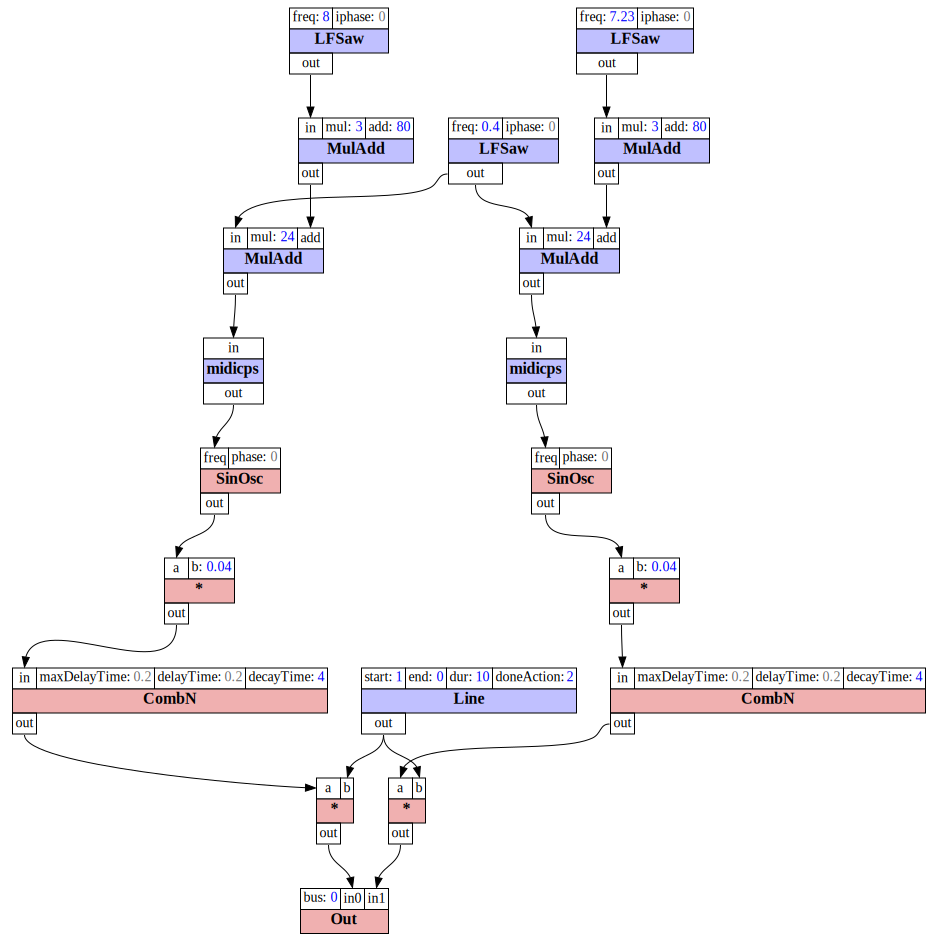

# Intro to SoundProcesses

If you have gone through the video tutorials of Mellite, you may wonder if there is more to it than the limited GUI interaction.
In fact, Mellite is, properly speaking, only the graphical user interface layer on top of a system of computer music abstractions
that is called _SoundProcesses_. When you create and manipulate objects in Mellite, you are actually creating and manipulating
objects in SoundProcesses, through the GUI provided by Mellite. In order to make use of the power of the system, it is thus
necessary to dive a bit deeper and learn about the application programming interface (API) provided by SoundProcesses. You may
still access this API through Mellite, but you may also choose to write your sound programs directly in a general code editor
or integrated development environment (IDE), such as IntelliJ IDEA.

The following figure illustrates the layers of the SoundProcesses and Mellite architecture:


In the following tutorial, we will write code as such an independent project, not making any references to Mellite. I will try
to assume that you have not much experience with either Scala, ScalaCollider (the sound synthesis library used by SoundProcesses)
or IntelliJ IDEA. However, I will also assume that you have some programming experience, perhaps in Java or SuperCollider, so
that some concepts may be familiar, although you know them from a different language.

This tutorial will thus be a quite long trip, introducing you to all of these things step by step. Instead of giving a
separate Scala tutorial (there are many resources [out on the Internet](http://scala-lang.org/documentation/learn.html)), I will
introduce Scala concepts as we encounter them.

@@@ note

This tutorial is a living document. Please help improve it by reporting problems in understanding, errors, or by making suggestions
on how to improve it. The best way is to pass by the [Gitter chat room](https://gitter.im/Sciss/Mellite), or if you can nail it down to a particular typo,
problem or suggestion, by filing a ticket in the [issue tracker](https://github.com/Sciss/Mellite/issues).

@@@


## Preparations

I assume that you have [SuperCollider](http://supercollider.github.io/), [Java](http://www.oracle.com/technetwork/java/javase/downloads/index.html), 
and [git](https://git-scm.com/) already installed on your system, and proceed from there. You can either copy and paste the code
snippets from this page, or clone the Mellite [repository](https://github.com/Sciss/Mellite/). Let's do the latter. In the following, a dollar sign `$` indicates the
terminal or shell prompt.

    $ cd ~/Documents  # or any place where you would like to download the repository to
    $ git clone https://github.com/Sciss/Mellite.git
  
This will take a while, then you will find the snippets project in `Mellite/site/snippets`. You can see that directory
[online](https://github.com/Sciss/Mellite/tree/master/site/snippets). This project uses [sbt](http://www.scala-sbt.org/) as a
build tool, however we'll just build and run from IntelliJ IDEA, so you don't actually have to install sbt at this point.

You can download IntelliJ IDEA [here](https://www.jetbrains.com/idea/download/). It is a development environment made by JetBrains,
and it comes in two flavours&mdash;'ultimate' and 'community'. The latter is free and open source, so we'll use that one. As of this
writing, on Linux this will download `ideaIC-2017.2.2.tar.gz`. The archive can be unpacked anywhere, and the application can be
launched with the shell script `bin/idea.sh`. If you have never run IntelliJ, it will ask you a few questions, among others it
offers you to install some plugins. Make sure that you choose to install the 'Scala' plugin. If you missed to do so, you can
install plugins from within IntelliJ by going to Settings &gt; Plugins and looking for 'Scala'.

Once IntelliJ has started, you should see its welcome screen:


Choose 'open' and navigate to the snippets directory inside the Mellite repository clone:


Next, you will be asked how to import the project. IntelliJ will detect that sbt is used to build the project, so the defaults should be fine:


If you have not set up a 'Project SDK' yet, you'll first have to press 'New...' &gt; JDK and locate your Java 8 installation (IntelliJ will
probably guess it right).

Next, IntelliJ will build the project information, download all the necessary libraries for this project, and finally give you a project browser.
If you don't see the browser, <kbd>Alt</kbd>-<kbd>1</kbd> will toggle it. Open the tree to `src` &gt; `main` &gt; `scala` &gt; `de.sciss.soundprocesses.tutorial`,
and locate `Snippet1`, the source code of which you can open by double-clicking on it:


You can build (compile) the project by clicking the green downward arrow button in the top-right of the window or typing <kbd>Ctrl</kbd>-<kbd>F9</kbd> on the keyboard.
If all goes fine, the status bar at the bottom should say something like

> Compilation completed successfully in 5s 388ms (moments ago)

If there was an error, a panel would pop up showing you the errors with links to the source code.

A few observations until here:

- IntelliJ IDEA is an application that manages software projects, giving you a project browser with directories to the source code
  of your project, a main editor window for creating and editing the source code, and actions to compile and run your code
- To edit Scala code, the Scala plugin for IntelliJ IDEA must be installed. It is capable of parsing build files for sbt, the
  Scala Build Tool, probably the most widely used build system for Scala based projects. You can see how that build file looks
  by double-clicking on `build.sbt`. At this moment, we take it for granted, but we'll see later what the essentials of these
  build files are. Basically, they define which libraries and Scala version your project uses.
- By convention, source code in Scala projects resides in the directory `src/main/scala` (there could be other locations, for 
  example `src/test/scala` for unit test source code, or `src/main/java` if you mix with Java source code, etc.)
- By another convention, we use packages for code, which are nested namespaces. That avoids clashes when multiple projects
  and libraries would otherwise use the same names for classes and objects. Following Java's tradition, packages are broken
  up into 'reverse URL components', so for example all my projects begin with package `de.sciss`, typically followed by
  further components clarifying the project, in this case `soundprocesses.tutorial`. You don't have to follow this pattern,
  but it helps organise your code.

IntelliJ IDEA can do a lot more things, like help you with versioning control (git), run a step debugger, and so forth. For now, we
use it as a code editor, compiler and runner. The code editor is very powerful, giving you things such as auto-completion, offering
intentions, easy navigation and look-up of methods and symbols you are using, showing you instantly errors and warnings, etc.
If you've worked with SuperCollider IDE, you'll notice that it is much more advanced; however, you will notice one big difference:
IntelliJ doesn't directly give you an interpreter where you can live-code. There are possibilities so drop into an interpreter,
but the focus is really to program a statically typed program. Mellite, in turn, has a much weaker IDE, but better access to
a live-code interpreter.

Now let's run the first snippet. Select `Snippet1` in the project browser (tree view) and choose 'Run' from the context menu or
press <kbd>Ctrl</kbd>-<kbd>Shift</kbd>-<kbd>F10</kbd>:


There are (at least) three possible outcomes now. Either it works, and you hear the famous 'Analog Bubbles' example sound of SuperCollider. In this
case you have completed the preparations. Or, most likely on Linux, it seems to run without error but there is no sound&mdash;probably Jack is
not well connected, we'll discuss that below.
Or, most likely on macOS and Windows, 
you'll see a runtime exception, complaining that 'scsynth' was not found, like this:

    Exception in thread "Thread-2" java.io.IOException: Cannot run program "scsynth": error=2, No such file or directory
    	at java.lang.ProcessBuilder.start(ProcessBuilder.java:1048)
    	at de.sciss.synth.impl.Booting.p$lzycompute(Connection.scala:182)

@@@ note

When you start a SuperCollider server from SoundProcesses, and you have not given any explicit information where SuperCollider is
installed, it will look into the environment variable `SC_HOME` to find the directory of the server program `scsynth`. If that environment variable
is absent, SoundProcesses will simply try to start `scsynth`, looking into the default locations for executables on your system.
This is great on Linux, because here it will usually find `scsynth` automatically. But on macOS and Windows, you will have to
either specify that environment variable, or provide an explicit path in your code.

@@@

The next subsection will address this problem.

### Making SoundProcesses find SuperCollider

There are different ways to set environment variables, including the possibility to set them globally on your system. The ScalaCollider
read-me has a [section](https://github.com/Sciss/ScalaCollider/blob/6c1758f480f3641b853de04d51d95a3da1c97f43/README.md#specifying-sc_home)
showing how this worked on OS X 10.6, but I am not sure this information is still valid. What we'll do here,
is simply tell IntelliJ to add such an environment variable.

You may have noticed that after running the snippet for the first time, its name appeared next to the green downward arrow in the top-right
of the screen. Here you find the so-called 'run configurations', i.e. specifications which and how to run parts of your code. If you click
on the name 'Snippet1' here, a popup menu opens offering you to 'Edit Configurations...':


Once you enter this dialogue, you'll see a dedicated section 'Environment variables'. Clicking the '...' to its right opens a key-value
editor for environment variables associated with that particular run configuration. Add a new entry here with name `SC_HOME` and the value
being the full path of the directory where the SuperCollider server program `scsynth` (`scsynth.exe` on Windows) resides on your harddisk.
On macOS, if you have a standard SuperCollider installation, the program is hidden inside the bundle of `SuperCollider.app`, so the path might be something
like `/Applications/SuperCollider.app/Contents/Resources/`. Here I have entered to full path of my Linux installation:


After confirming all the dialogs, make sure you stop the hanging program with <kbd>Ctrl</kbd>-<kbd>F2</kbd> or by pressing the red stop button, and try to run
it again using <kbd>Ctrl</kbd>-<kbd>F10</kbd> or the green play button. If you didn't make a typo, SuperCollider should boot now and play the familiar analog
bubbles tune for about ten seconds before stopping automatically.

### Fixing Jack Audio Routing

On Linux, SuperCollider talks to your sound card through the [Jack Audio Connection Kit](http://www.jackaudio.org/) (Jack). When you start
the SuperCollider server and Jack doesn't run, SuperCollider will launch an instance itself. If this is the case you might see a message like this:

> JACK server starting in realtime mode with priority 10<br>
> ...<br>
> Acquire audio card Audio0<br>
> creating alsa driver ... hw:0|hw:0|1024|2|48000|0|0|nomon|swmeter|-|32bit

The problem with not hearing sound then
is due to the fact, that you also to specify which output channels of SuperCollider should be wired to which channels of your sound card.
There is one tinkering way to do that, and that is to set environment variables `SC_JACK_DEFAULT_INPUTS` and `SC_JACK_DEFAULT_OUTPUTS`.
You can look at the previous subsection to learn how to add environment variables to a run configuration in IntelliJ. Here's an example value
for `SC_JACK_DEFAULT_OUTPUTS` that would work in my case: `system:playback_1,system:playback_2`.

An, in my opinion, better approach however is to make use of a small tool that can manage all your jack connections through a patchbay.
This tool is [QJackCtl](https://qjackctl.sourceforge.io/), and on Debian and Ubuntu the installation should be as simple as running `sudo apt install qjackctl`.
You can create different presets for different sound cards in QJackCtl, patchbays that wire up clients such as SuperCollider with sound cards
or other applications, and you start the Jack server from QJackCtl. When QJackCtl is running and you started Jack through it, as soon as
SuperCollider boots, QJackCtl will notice it and make activate the appropriate patchbay wiring if you have defined one. Here is a screenshot
of my default patchbay:


You can see that I populated it over time with many different clients. You can configure the client name of SoundProcesses, but by default
it will be 'SuperCollider'. From QJackCtl's main window, you can use the 'connect' button to see which clients are currently running and how
they are wired up. In this case, launching the example snippet, I have this situation:


Again by default, SuperCollider will boot with eight channels of in- and output. I have only wired the first two outputs to the stereo output
of my internal sound card here. That's fine.

## Hello World

Before we go through the code of `Snippet1`, let us go one step back and see how the most basic Scala program can be created. The following
snippet is from `HelloWorld.scala`:

@@snip [HelloWorld]($sp_tut$/HelloWorld.scala) { #helloworld }

This is more or less the shortest Scala program one can write. Let's take a moment to understand what happens here. Scala has two basic entities:
__values__ and __types__. A value can be a constant literal such as an integer number `123` or a double floating point number `1.234`, a boolean
`true` or `false`, a string `"Hello"`, etc. Or a value can be a more complex `object`, i.e. something comprised of members (values, types, methods),
possibly with some body of initialising statements. A type can be either some abstract type variable, or a specific class or trait. Classes and traits
are very similar in Scala, the main difference being that classes can take constructor parameters, and a sub-class or object can only be derived from
exactly one (super-)class, whereas they can be derived from multiple traits. We'll come to this later. What we see in the hello-world example is that one
`object` is defined which is given the name `HelloWorld`, and the `extends App` clause means it derives from the trait `App` which is defined by
the [standard Scala library](http://www.scala-lang.org/api/current/) that is always available. The `App` trait is a shortcut for conveniently defining executable programs, so we thereby
mark the object as a possible starting point for executing our program. When an `object` is evaluated, all the statements in its body, which is
everything between the curly braces `{` and `}`, are executed sequentially. Here we have only a single statement, `println("Hello world")`.

When you right-click on `HelloWorld` in the project browser of IntelliJ and select 'run', IntelliJ will, like it did before with `Snippet1`, create
a corresponding run configuration, if it doesn't exist yet, then launch that configuration. If we edit the configuration, we can see that `HelloWorld`
is selected as the 'main class':


What you can see here also is that the fully qualified name is `de.sciss.soundprocesses.tutorial.HelloWorld`. This is because if you look into the
file, we declared `package de.sciss.soundprocesses.tutorial` at the top of the file. As mentioned before, packages allow us to put symbols (such as
the name `HelloWorld`) in places so we can later import them easily as we make use of them, and we avoid name clashes. Scala's packages are similar
to Java's, but SuperCollider does not have any corresponding concept.

It may appear confusing that `HelloWorld` is the main _class_, because I just said there are values and objects on one side and types and classes on the other side. It so happens that
an `object`, sometimes called _singleton_ in Scala, also represents a class, however a very particular one, in that it cannot be explicitly instantiated,
instead the object, once referred to, always represents the one singleton instance of its class.

The way we enter the main class is actually a pecularity of the Java Virtual Machine on which Scala runs. If we remove the `App` trait, we can
be more explicit about this entry point:

@@snip [HelloWorldExplicit]($sp_tut$/HelloWorldExplicit.scala) { #helloworldexp }

What we have to do here explicitly for `HelloWorldExplicit` to work as an entry point to executing the program, is to define a method `main` as shown.
Methods are defined with the `def` keyword, followed by the method's name, then optionally one or several groups of parentheses in which the method's
arguments are specified. In Scala, values and arguments are specified as `name: Type`, contrary to some other languages such as Java, where the
order is reversed as `Type name`. Once you get used to Scala's order, it actually makes a lot of sense, especially when considering that the `: Type` annotation
can be left out for local values, where the compiler will then automatically infer the type. Of course, if you come from a dynamically typed language such as
SuperCollider, this may all appear odd, as in those languages you typically do not state the (expected) type of arguments at all, but rely on the caller
knowing what type to pass. Having to explicitly specify types may appear cumbersome in the beginning, but the huge advantage is that the compiler will
check all invocations of your method at compile time and prevent calling a method with the wrong types of arguments before you even attempt to run the program.

If you are familiar with Java, here is the corresponding Java variant of `HelloWorldExplicit`:

```java
public class HelloWorldJava {
    public static void main(String[] args) {
        System.out.println("Hello world!");
    }
}
```

In SuperCollider, there is no concept of a 'main class', so it doesn't really translate. But the code would be roughly as follows:

```supercollider
HelloWorldSuperCollider {
    *main { |args|
      "Hello world!".postln;
    }
}
```

In other words, methods in singleton objects in Scala can be compared with `static` methods in Java or _class methods_ (with asterisk `*`) in SuperCollider.
The argument passed to a main class in Scala is of type `Array[String]`. An array in Scala is very much like an array in SuperCollider, a mutable sequence
of elements with constant access performance, with the distinctiveness that one has to specify the element type, so we cannot mix heterogenous elements within the same array, unless we
give a very generic element type, e.g. `Array[Any]`, `Any` being the top type in Scala of which all other types are sub-types.

The `main` method is annotated with a _return type_ `: Unit`, which roughly corresponds to `void` in Java. In SuperCollider, one would have `Nil` instead.
The body of a method is written on the right-hand side of the equals symbol, so in general the shape of a method definition in Scala is

```scala
def methodName(arg1: ArgType1, arg2: ArgType2, ...): ReturnType = Body`
```

By convention, method, argument and variable names begin with a lower case letter, and object names, types, class and trait names begin with an upper case letter, 
but there are circumstances when one would probably deviate from this convention. The body of a method can be written "plain" without extra ceremony, but if
the body is formed of more than one statement, one has to group them together with curly braces `{`, `}`. It is never forbidden to place those braces even if
they are not necessary. I have done that in the `main` method of `HelloWorldExplicit`. I could as well have written

```scala
def main(args: Array[String]): Unit = println("Hello world!")
```

or

```scala
def main(args: Array[String]): Unit = 
  println("Hello world!")
```

Here is a snippet where the braces are needed because we have multiple statements:

@@snip [HelloWorldMultiple]($sp_tut$/HelloWorldMultiple.scala) { #helloworldmultiple }

You may have noticed that we don't use semicolons between the statements. They are automatically inferred by Scala, and only rarely one needs to use semicolons
(for example if one wants to place multiple statements on a single line). The last example also shows a `val` declaration. `val` stands for 'value' and binds
the right-hand side to a "variable" (symbol) on the left-hand side, although this "variable" is immutable, i.e. its value cannot be replaced. It's similar to a `let`
statement in Lisp. Although Scala also has a `var` keyword for defining mutable variables, it is good practice to stick to `val`s whenever possible, as it
greatly reduces the risk of cluttered code. Unlike SuperCollider where `var`s can only be defined at the very beginning of a method, in Scala we
define the `val`s at the point where we actually assign their content. Like Java and SuperCollider, Scala has a `new` keyword to create an instance (value) of a class,
in the previous example of the class `java.util.Date`. In SuperCollider, the `new` keyword is written as a class method, so it would be `Date.new`, and
conveniently one can also drop the `.new` call and just write `Date()`. Scala has a similar feature called case-class, which we will learn about later, but in
general, classes have be instantiated by writing `new ClassName`.

## Playing a Sound

After this dense prelude, let us look at the content of the first snippet that launches SuperCollider and plays a sound. Here is the full code:

@@snip [Snippet1.scala]($sp_tut$/Snippet1.scala) { #snippet1 }

The `object Snippet1 extends App` bit should be familiar now&mdash;it means we define an executable program in the body of this object. But almost everything else
will be new, so let's go through it piece by piece:

### Importing Symbols

The first lines are comprised of `import` statements. Since values and types reside in packages, they are not automatically visible in a Scala program. There are a few
exceptions such as everything that's in the `scala.` and `java.lang.` namespaces, for example we can write `String` although the fully qualified type is `java.lang.String`,
and we can write `extends App` instead of `extends scala.App`. Typically, one imports the types one wishes to use at the top of a source code file, although it is not
mandatory. At any point we can write the fully qualified name with the packages separated by dots, and there are even some conventions to do so in certain cases to make the
intent more clear: For example Scala's standard library contains both immutable and mutable collections, so you could write `immutable.Set` and `mutable.Set` to visually
distinguish them at the place where they are used without having to look up which one was imported. Since immutable is the recommended standard, it boils down to people
using `Set` to indicate the immutable set, and `mutable.Set` to flag the use of the mutable variant. Actually, the fully qualified name is `scala.collection.mutable.Set`, so
for this to work, one still needs an `import scala.collection.mutable`&mdash;that brings the package `mutable` into scope, just as you would bring
a class into scope! This may be surprising, but you will see that Scala is designed around a principle of regularity, which means that it tries to apply the same principle
to all things equally. A package is just a symbol as much as a class is a symbol, so if you can import a class, you should be able to import a package as well. In fact, you can also
import values, e.g. `import math.Pi` to use the symbol `Pi`.

In the same spirit, Scala also tries to avoid arbitrary constraints for where you can write these things. Import statements can be written anywhere you like, at
any nesting level. This is why I could write `import de.sciss.synth._` further down in the code, inside the `SynthGraph { ... }` block. It is intuitively clear that the imported
symbols are now only visible within this particular block. Here the underscore `_` selects
all symbols inside the package `synth`. This is a nice and short way of quickly getting hold of all the main types in [ScalaCollider](sciss.github.io/ScalaCollider/), the sound synthesis library used by
SoundProcesses. Such "wildcard import" may have the disadvantage of bringing unwanted symbols into scope that could, for example, result in a name clash. That's the reason
why I prefer here to place that import right where I will make use of it, but it would also have been possible to add it to the top of the file. Take a look at the next line,
`import ugen._`. This could be called a recursive import, perhaps, because `ugen` is a sub-package inside `synth`, so I'm abbreviating `import de.sciss.synth.ugen._`
to `import ugen._` because it's less to type, and this is possible because the previous line imported everything that's inside `synth`, including the `ugen` sub-package.

@@@ note

How would we possibly know which classes and types are hidden in which packages? There are two answers to this: First, make use of IntelliJ's auto-completion and import helper,
and second, consult the API docs. The API docs for Scala's standard library are [here](http://www.scala-lang.org/api/current/), and those of Mellite and SoundProcesses are
[here](http://sciss.github.io/Mellite/latest/api/de/sciss/index.html).

@@@

The API docs are the products of an automatic process called scala-doc, and these pages list the packages on the
right-hand side, and at the top of the screen you have a search field. Say we want to know about `SynthGraph`, let's type that into the
[search box](http://sciss.github.io/Mellite/latest/api/de/sciss/index.html?search=SynthGraph):


The left-hand side shows objects and types containing the search term, whereas the right-hand side tries to find methods and nested values and classes containing the search
term. In 'entity results', we can spot the type `SynthGraph` as being part of package `de.sciss.synth` (this is the base package of ScalaCollider), there is another thing
called `SynthGraphObj` in package `de.sciss.synth.proc`&mdash;that's the base package of SoundProcesses. We were looking for the former. You can see two small icons to the
left of the name, a dark blue 'O' and a green 'C'. The 'O' stands for singleton object, the 'C' stands for class. A light blue 'T' stands for trait, remember that traits are like classes
but without constructor arguments. Often in Scala, a class or trait has a corresponding object of the same
name, that is called the _companion object_. Often static members and constructor methods of a class or trait are found on the companion object, that's why they are grouped together
in the API docs.

In IntelliJ, if a symbol is not in scope, for example if we removed the import statements from the snippet source, the editor renders them in red, with a tool-tip indicating that
<kbd>Alt</kbd>-<kbd>Enter</kbd> would bring up an import helper dialog:


The import helper will show you all classes matching the name within all libraries of your project, highlighting the most likely candidate (`de.sciss.synth.SynthGraph` here).
When you confirm this dialog, IntelliJ will add the import to the top portion of your source code. Auto-completion works while you type. For example, imagine that
`SynthGraph` wasn't imported yet, and you begin typing `val bubbles = SynthG`…, then you'll notice that below your cursor IntelliJ lists the possible candidates to complete the
name you are writing:


Here, for some reason, the symbol we want is the second row; we can use the cursor keys and then press <kbd>Enter</kbd> to select and import it. IntelliJ is very smart with the
auto-completion, it suffices to give some hints in the ["camel-case"](https://en.wikipedia.org/wiki/Camel_case#Programming_and_coding) way, for example writing `val bubbles = SG`… will also find the `SynthGraph` symbol we are looking for.

### Defining a SynthGraph

The sound we are hearing is mainly defined by the `SynthGraph { ... }` block, so let's dive into that. I'm reproducing it here again:

@@snip [Snippet1 - SynthGraph]($sp_tut$/Snippet1Parts.scala) { #snippet1graph }

You may know that in SuperCollider, sound synthesis functions are defined within a `SynthDef`. This type also exists in ScalaCollider, but you will rarely deal with it directly.
Instead, the `SynthGraph` is a slightly higher level abstraction that will be eventually translated into a `SynthDef` by the system. The main two differences are:

- a `SynthGraph` does not have a name. Names are assigned automatically by the system, although you can give a name-hint when creating a synth, which might be helpful for
  debugging purposes
- a `SynthGraph` preserves the graph elements in their "unexpanded" way. When the system translates the `SynthGraph` into a `SynthDef`, it enforces things like multi-channel-expansion
  and thereby translates each graph element in one or several UGens or constants, optimises away dead branches, etc. To give an example, there are graph elements which expand to other
  graph elements and do not have a direct correspondance with one UGen. In SuperCollider, these are sometimes called pseudo-UGens. A typical pseudo-UGen is `Mix`. In SuperCollider, when
  you write `Mix([ PinkNoise.ar(0.1), FSinOsc.ar(801, 0.1), LFSaw.ar(40, 0.1)])]`, you immediately get the expanded `Sum3` UGen, whereas in ScalaCollider, an instance of the `Mix` class
  will actually be stored in the `SynthGraph`. Or if you write `SinOsc.ar([400, 600])` in SuperCollider, you immediately get an array of two `SinOsc` UGens, whereas in ScalaCollider the
  graph element `SinOsc` is one object with the multi-channel input. This behaviour enables a number of interesting ways in which synth graphs can be manipulated and extended.
  For SoundProcesses, it means you will have a great number of graph elements which bridge the `Synth` to its environment such as control inputs, even if those inputs are not yet
  defined or determined at the moment the graph function is written. This makes the `SynthGraph` in SoundProcesses more akin to the functions in SuperCollider's JITLib.

Other than that, creating a `SynthGraph` looks exactly like creating a `SynthDef` (minus the naming). The graph elements corresponding with UGens are written almost identical to their
SuperCollider counterparts. The analog bubbles graph in SuperCollider would be written like this:

```supercollider
b = SynthDef(\bubbles, {
  var o = LFSaw.kr([8, 7.23]).madd(3, 80);
  var f = LFSaw.kr(0.4).madd(24, o);
  var s = SinOsc.ar(f.midicps) * 0.04;
  var c = CombN.ar(s, 0.2, 0.2, 4);
  var l = Line.kr(1, 0, 10, doneAction: 2);
  Out.ar(0, c * l)
});
```

@@@ note

Using `.madd` calls in SuperCollider is not very common. Most UGens do have artificial trailing inputs for multiplication and addition, which are then rewritten as `.madd` calls that
produce the according binary-op or `MulAdd` UGen. I didn't adopt this approach in ScalaCollider, so here you have to explicitly use `.madd` to scale the output of UGens.

@@@

The syntactic differences are minimal&mdash;you would prefer `val` over `var`, dispense with the semicolons, and named arguments are filled with an equals character instead of a period, so it's
`doneAction = freeSelf` instead of `doneAction: freeSelf` (in newest SuperCollider, you can write `doneAction: \freeSelf`, whereas in older versions you have to use the integer code `doneAction: 2`).
Perhaps the greatest difference here is how multi-channel-expansion arguments are written. In SuperCollider, array literals are written using brackets `[`, `]`. In Scala, the brackets are reserved
for type parameters, so there is no direct way of writing an array literal. One could write `Array(8, 7.23)` to create an array, but ScalaCollider requires that you use one of Scala's standard
sequential collection types instead. [Here](http://docs.scala-lang.org/overviews/collections/overview.html) is an overview of Scala's collections types. We will mostly write `Seq(...)` or `List(...)`
to create multi-element arguments for UGens to produce multi-channel-expansion. `Seq` is the shortest, and an abstract trait, whereas `List` is a concrete implementation,
an immutable singly-linked-list similar to a [cons-list](https://en.wikipedia.org/wiki/Cons#Lists) in Lisp languages.

If you are completely unfamiliar with SuperCollider, here are the core concepts of UGen graphs:

- a sound signal processing graph is created by "plugging" a number of so-called Unit Generators (UGens) into one another. A UGen is a building block of a DSP function that takes a number
  of inputs (or zero, if it is a pure generator) and produces a number of outputs (or zero, if it is a pure sink with side effects, e.g. sending a signal to the sound hardware).
- the UGens are implemented as classes with constructor methods on their companion objects that are usually called `.ar`, `.kr` and `.ir`. These indicate the calculation rate of the UGen.
  In the SuperCollider server, UGens can either run at full audio rate (`ar`) or at a reduced control rate (`kr`). `ir` is a special case of control rate, called scalar or init rate,
  where the UGen's value is calculated only once when the synthesis process is started.
- so we can read the function from top to bottom: `LFSaw.kr` creates a low-frequency (LF) sawtooth oscillator with a frequency in Hertz given by its argument. Like many oscillators, the output of
  this sawtooth runs between -1 to +1, so the subsequent `.madd` wraps this UGen in a second UGen that scales this value range to the range (-1 * 3 + 80 = 77) to (+1 * 3 + 80 = 83).
- the next line produces another sawtooth oscillator at 0.4 cycles per second, mixing its output with the previous sawtooth oscillator, 
  producing the nominal range (-1 * 24 + 77 = 53) to (+1 * 24 + 83 = 107).
- the next line creates a sine oscillator at audio rate, the frequency between the summed sawtooth oscillators fed through the `.midicps` unary operator function, translating from
  [midi pitch](https://en.wikipedia.org/wiki/MIDI_tuning_standard#Frequency_values) values to Hertz. The sine oscillator frequency thus moves in the range (53.midicps = 174.6) to (107.midicps = 3951.1). The amplitude of the sine's nominal -1 to +1 is scaled by
  the factor 0.04 or -28 dB.
- the `CombN` UGen is a non-interpolating comb filter, the input here being the sine oscillator, using a fixed delay time of 0.2 seconds and a 60 dB decay time of 4 seconds. It reverberates
  the sine oscillator.
- the `Line` UGen defines a ramp going down from 1 to 0 in 10 seconds, with the `doneAction` argument specifying that the entire synthesis graph should be stopped once the target value has
  been reached. We multiply the comb filter with this ramp, thereby slowly fading the sound out.
- the `Out` UGen sends the faded comb to the audio interface's first channel (bus index 0 corresponds with the first output channel).

Since the first sawtooth oscillator takes a sequence of two values, `Seq(8, 7.23)`, as its frequency argument, this essentially creates a two-channel signal here in the graph, which will automatically
propagate through the entire graph, as this oscillator becomes the argument of other oscillators. The `Out` UGen then correctly "consumes" the two-channel signal, meaning that it writes
the first channel to bus index 0, and the second channel to the adjacent bus index 1, sending thus a stereo signal to the sound card.
If we looked at the expanded UGen graph, it would look like this:



### Transactional and Aural System

We now return to the beginning of the snippet, with the following two lines:

@@snip [Snippet1 - Systems]($sp_tut$/Snippet1Parts.scala) { #snippet1systems }

Here is where SoundProcesses for the first time diverges from "plain" ScalaCollider. ScalaCollider is written with a simple mutable and imperative model in mind. For example, when you
write `Synth.play` in ScalaCollider, that action directly sends out OSC messages to the sound synthesis server. When a buffer information is updated, it mutates information fields in the client side
`Buffer` representation. In contrast, SoundProcesses is designed on top of a [software transactional memory](https://en.wikipedia.org/wiki/Software_transactional_memory) (STM). This is a kind of
compromise between the imperative model and the purely functional model, where model updates would never be destructive but create new trees that replace the old trees. STM gives us good things
from both imperative and functional models: We can still run commands as if they were imperative, and we don't need to "thread state" throughout our program, something that works for small scale
applications, but becomes very difficult in larger and interactive scenarios. On the other hand, destructive changes are deferred to the moment, where a so-called transaction is successfully
completed (committed). If at any point "inside" the transaction a problem occurs, all pending changes to the system are rolled back, and no destructive actions, such as sending OSC messages, are
performed. Theoretically, this also allows the program to run fully concurrently (remember that SuperCollider uses cooperative multi-tasking and is essentially single-threaded, thereby avoiding the
problem of concurrent mutable state, while introducing the problem of not being able to run processes in parallel). In practice, transactions can become quite big and thus chances are high that
concurrent transactions collide and will be rolled back and retried at the cost of additional running time. Most of the time, this is not an issue, however, as most programs can indeed be dispatched on a
single thread and no concurrent transactions.

When I said that SoundProcesses is based on STM, this is only half of the truth. In fact, we use an abstraction from STM that allows us at the same time to move objects from memory to the harddisk.
If you have worked with Mellite, you'll know that editing things in the workspace are automatically persisted in the workspace database on disk. This happens automatically, because when a
"durable" workspace is used, instead of just an in-memory STM, the transactions of the STM are coupled to [ACID](https://en.wikipedia.org/wiki/ACID) database transactions.
In SoundProcesses speak, the memory model used is a "system".
The system, embodied by trait `de.sciss.lucre.Sys` and the extension `de.sciss.lucre.synth.Sys` that adds sound synthesis abstractions, can be one of `InMemory`, `Durable` and `Confluent`.
The first is essentially a plain STM with no storage on a secondary memory. This is the system we use in our example snippet. The call `InMemory()` creates such a system. `Durable` would
be the variant that stores all objects on the disk, and `Confluent` would extend the durable case by adding confluent persistence, which means the history of the changes to objects is preserved
as well. In the example snippet, there aren't actually any objects that could be persisted, so changing to `Durable` wouldn't make any difference. We will see in later tutorials how specific
objects are created in SoundProcesses. Here, we simply provide a system that is necessary to interoperate with the sound synthesis related types such as `AuralSystem` and `Synth`. These only
use the STM part of the system, so they wouldn't interact with the persistence layer.

`AuralSystem` in SoundProcesses embodies the object that can boot a SuperCollider server. It's methods are transactional, and that's why we have to create a system such as `InMemory` first.
Let's look at the code that uses the aural system:

@@snip [Snippet1 - Transactions]($sp_tut$/Snippet1Parts.scala) { #snippet1txn }

The value `cursor` holds our instance of `InMemory`. Most systems are at the same time "cursors" which means they provide a means to issue a transaction through the `step` method. When we write
`cursor.step { implicit tx => ... }` we encapsulate everything that is inside the curly braces in a transaction. When that method returns, the transaction has been closed and committed.
The basic definition of [Cursor](http://sciss.github.io/Mellite/latest/api/de/sciss/lucre/stm/Cursor.html) is

```scala
trait Cursor[S <: Sys[S]] {
  def step[A](fun: S#Tx => A): A
}
```

For somebody familiar with Scala, this is straight forward, and in this case you can skip the next paragraphs; but otherwise this needs extensive explanation. The `Cursor` trait has a type
constructor argument `S` which is constrained by the recursive formulation `<: Sys[S]`. Technically, this means the type `S` is F-bounded. Practically, it means that `S` must be a sub-type
of `Sys`. In our example, `S` would be equal to `InMemory`. Almost all abstractions in SoundProcesses exhibit this `S <: Sys[S]` type parameter. It means that an object is always configured
with a particular type of transactional system&mdash;in-memory, durable, etc.&mdash;and that in order to use it you must provide a matching transaction. This prevents for example that a
durable object could be manipulated with an in-memory transaction for which no database handle exists. If we replace `S` by `InMemory`, the `step` method becomes

```scala
def step[A](fun: InMemory#Tx => A): A
```

The strange looking type `InMemory#Tx` is called a type-projection in Scala, and you can simply think of it here as a type member provided by `InMemory`. All transactions share a common
interface [Txn](http://sciss.github.io/Mellite/latest/api/de/sciss/lucre/stm/Txn.html) which is capable, among other things, of creating primitive transactional variables. The argument to `step` is
a _function_ of arity 1, that is a function that takes a single argument of type `InMemory#Tx` and returns a value of type `A`. In Scala, `A => B` is shorthand for `Function1[A, B]`.
Often we provide functions as [lambdas](https://en.wikipedia.org/wiki/Anonymous_function), also called anonymous functions or function literals. Let's take a simpler example, using a
collection, say `List(1, 2, 3, 4)`. A list, formally `List[A]` where `A` is the type of the elements in the list, has a method `filter` defined as follows:

```scala
def filter(pred: A => Boolean): List[A]
```

In other words, `filter` takes a predicate, a function returning a boolean, and applies it to all of its elements, collecting in a resulting new list of the same element type only those
elements for which the predicate holds (yields `true`).

```scala
List(1, 2, 3, 4).filter({ x => x > 2 })
```

The result will be `List(3, 4)`. The filter function in SuperCollider's collections is called `select` and acts very similarly:

```supercollider
List[1, 2, 3, 4].select({ |x| x > 2 })
```

Very similar to SuperCollider, when the sole argument of a method is a function, we can drop the parentheses and just use the curly braces:

```scala
List(1, 2, 3, 4).filter { x => x > 2 }
```

On the other hand, if the lambda only occupies a single line, we can also do the opposite&mdash;keep the method invocation parentheses and drop the curly braces:

```scala
List(1, 2, 3, 4).filter(x => x > 2)
```

Sometimes you'll also see this shortcut (again, something similar exists in SuperCollider):

```scala
List(1, 2, 3, 4).filter(_ > 2)
```

So back to the `step` method. When invoked, it calls the function argument, passing it a fresh transaction, then returns the function's result to the caller.
A distinctive feature of Scala is that both an argument list of a method definition and the argument list of a function literal can be qualified with the modifier
`implicit`. To understand this, let's look at the `start` method of `aural` that is invoked at the end of the cursor-step block. Its definition is:

```
trait AuralSystem {
  def start(config: Config = Server.Config(), connect: Boolean = false)(implicit tx: Txn): Unit
}
```

First of all, we can see _default arguments_ provided for `config` and `connect`. These are used when no arguments are specified in the invocation. Since we call `aural.start()`
the default arguments for `config` and `connect` are both filled in automatically. If we wanted to customise the SuperCollider server, we would provide a `config` argument, like so:

@@snip [Snippet1 - Server Config]($sp_tut$/Snippet1Parts.scala) { #snippet1config }

More importantly, `start` has a _second_ argument list given as `(implicit tx: Txn)`, but in our call `aural.start()` there is no sign of this argument list. This is exactly
because it is marked as `implicit`. We can call methods without providing arguments for an implicit argument list in Scala, and in that case the compiler will look for us in
the current scope for implicit values matching the expected argument type(s). Because the lambda `implicit tx => ...` has indeed marked the transaction argument as `implicit`,
it will now be automatically passed into the second, implicit argument list of `start`. Scala also allows us to specify this argument explicitly, so we could also have written:

@@snip [Snippet1 - Explicit Arguments]($sp_tut$/Snippet1Parts.scala) { #snippet1explicit }

Since the entire interface of SoundProcesses uses transactions, it would be extremely annoying and impeding for the eye if we had to pass the `tx` transaction values everywhere.
Thanks to implicits in Scala, the compiler can do this job for us. Implicits are a great way to pass contexts along in an API. There are other ways in which implicits are used,
for example in ScalaCollider, when you use a constant number as a UGen input, say `SinOsc.ar(440)`, this number `440` of type `Int` is implicitly lifted to another type
`Constant(440)` which is part of
the graph element API of ScalaCollider. This is called _implicit conversion_ and is a bit more complex than just _implicit arguments_ and _implicit values_.
And there are more cases. For now, it suffices to understand that the transactional interface in SoundProcesses always uses an
implicit argument of type `Txn` or `S#Tx`. The former is a "generic" transaction that only gives STM information, and it is used by the sound synthesis level that has no
business with persisting objects. The latter, `S#Tx`, is the particular transaction type of a system `S` (such as `InMemory#Tx` or `Durable#Tx`), and it is used wherever an
object may participate in the storage of a workspace.

Before we start the aural system&mdash;which means that the SuperCollider server will be booted when the transaction is committed&mdash;we register a callback
of type `AuralSystem.Client` which will be invoked when the server has completed booting or was quit. Using `new Type { ...definitions }` is an ad-hoc way to implement a
trait such as `AuralSystem.Client`. That trait says there are two abstract methods `auralStarted` and `auralStopped` which must be implemented by us. We don't care
about the server quitting, so we simply say `def auralStopped()(implicit tx: Txn): Unit = ()` where `()` is an empty value meaning "do nothing". We _do_ want to react to the
server having booted, though, so we define the behaviour of `auralStarted`:

@@snip [Snippet1 - auralStarted]($sp_tut$/Snippet1Parts.scala) { #snippet1started }

The method is invoked with the `Server` as first argument, and again there is a second implicit argument list that gives us a transaction. That transaction is necessary to
be able to use `Synth.play`, as this call requires an implicit transaction. You may be tempted to think that `Server` is ScalaCollider's
`de.sciss.synth.Server` and that `Synth` is `de.sciss.synth.Synth`, but if you look at the imports, they are actually in a different package:
[`de.sciss.lucre.synth.Server`](http://sciss.github.io/Mellite/latest/api/de/sciss/lucre/synth/Server.html) and [`de.sciss.lucre.synth.Synth`](http://sciss.github.io/Mellite/latest/api/de/sciss/lucre/synth/Synth.html). There are, in other words, classes mirroring the familiar ScalaCollider classes, but now, inside SoundProcesses, they are changed to transactional semantics.
If we call `Synth.play`, that `/s_new` OSC message is not fired straight away, but only after the transaction is successfully completed will such a message be sent
to the server. Moreover, the methods are enhanced, because SoundProcesses does a lot more work to manage synthesis instances, including the automatic registration
of a synth-def, preparing buffers, and so on. SoundProcesses takes care to correctly package the OSC bundles when there are asynchronous preparations, such as
allocating and filling a buffer. Here is the definition of the `Synth.play` method:

```scala
object Synth {
  def play(graph: SynthGraph, nameHint: Option[String] = None)
          (target: Node, args: ISeq[ControlSet] = Nil, addAction: AddAction = addToHead, dependencies: List[Resource] = Nil)
          (implicit tx: Txn): Synth = ...
}
```

So it is quite different from ScalaCollider:

- instead of the name of a `SynthDef` that we had to take care to have sent to the server, here we directly give a `SynthGraph` along with
  an optional name-hint.
- there is a new argument `dependencies` that is used when the system must ensure that those dependencies are met before the synth can be
  actually started. The most common `Resource` type is [`Buffer`](http://sciss.github.io/Mellite/latest/api/de/sciss/lucre/synth/Buffer.html).
- again an implicit transaction `Txn` is needed

Similar to ScalaCollider, we can pass the server `s` for the `target` argument, because it will be implicitly converted to `s.defaultGroup`
to provide the required `Node` type. Here,
the system will automatically cache synth-defs, so if we start multiple synths with the same synth-graph, only in the first iteration will
a synth-def be created and sent to the server.

It remains to look at the second statement: `syn.onEnd(sys.exit())`. This registers a non-transactional callback invoked when the synth has been
removed from the server. There is also a variant `onEndTxn` that can be used when we need a transactional context. Here we simply exit the virtual
machine and thus quit the program execution.

